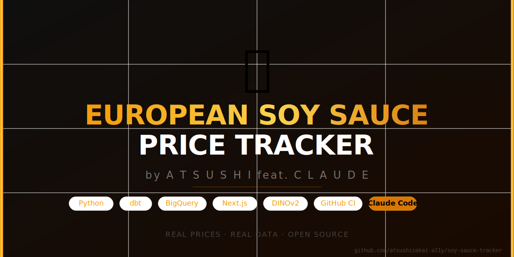

# 🫙 European Soy Sauce Price Tracker
### *by Atsushi feat. Claude*

> An end-to-end data engineering project — web scraping → ML image matching → data warehouse → live public dashboard.

[](https://github.com/atsushisakai-a11y/soy-sauce-tracker/actions)
[](https://www.getdbt.com)
[](https://cloud.google.com/bigquery)
[](https://nextjs.org)
[](https://claude.ai/code)

---

## What it does

Tracks and compares soy sauce prices across European online shops every month.  
Products are **automatically matched across shops** using computer vision (DINOv2 + colour histograms), so you can see price differences for the exact same bottle regardless of how each shop names it.

👉 **[Live Dashboard](https://soy-sauce-tracker.vercel.app)** — prices, trends, and min/max comparisons  
👉 **[Tech Stack](https://soy-sauce-tracker.vercel.app/tech)** — how it's built

---

## Data Pipeline

```
1. Scrape          →  2. Image Similarity  →  3. dbt Staging
   Python               DINOv2 + rembg          Normalise + join
   Playwright           Union-Find                global_product_id

4. dbt DWH         →  5. dbt Datamart      →  Dashboard
   SCD Type 2          Monthly min/avg/max      Next.js + Recharts
   dim_price_history   per product              BigQuery → Vercel
```

Orchestrated by **GitHub Actions** · runs monthly · Telegram alerts on completion.

---

## Tech Stack

| Layer | Tool | Purpose |
|---|---|---|
| Scraping | Python + Playwright | Crawl European shops, extract prices + images |
| Matching | DINOv2 + rembg + PyTorch | Match same products across shops via image similarity |
| Transform | dbt + BigQuery | 4-layer model: raw → staging → dwh → datamart |
| Warehouse | Google BigQuery (europe-west4) | Cloud data warehouse |
| Orchestration | GitHub Actions | 5-step pipeline + Telegram notifications |
| Dashboard | Next.js 14 + Recharts + Tailwind | Public-facing price tracker website |
| AI pair | Claude Code | Built the entire pipeline iteratively |

---

## Project Structure

```
soy-sauce-tracker/
├── scraper/          # Playwright-based price scraper
├── similarity/       # DINOv2 image similarity + product ID assignment
├── loader/           # BigQuery data loaders
├── dbt/              # dbt project (staging / dwh / datamart models)
├── web/              # Next.js dashboard (deployed on Vercel)
└── .github/workflows # 5 GitHub Actions workflows
```

---

## Running locally

**Dashboard:**
```bash
cd web
cp .env.local.example .env.local  # add your GCP credentials
npm install && npm run dev
# → http://localhost:3000
```

**dbt:**
```bash
cd dbt
dbt deps && dbt run
```

**Scraper:**
```bash
cd scraper
pip install -r requirements.txt
python scraper.py
```

---

*Built by Atsushi feat. Claude — because great data engineering is a collab.*
